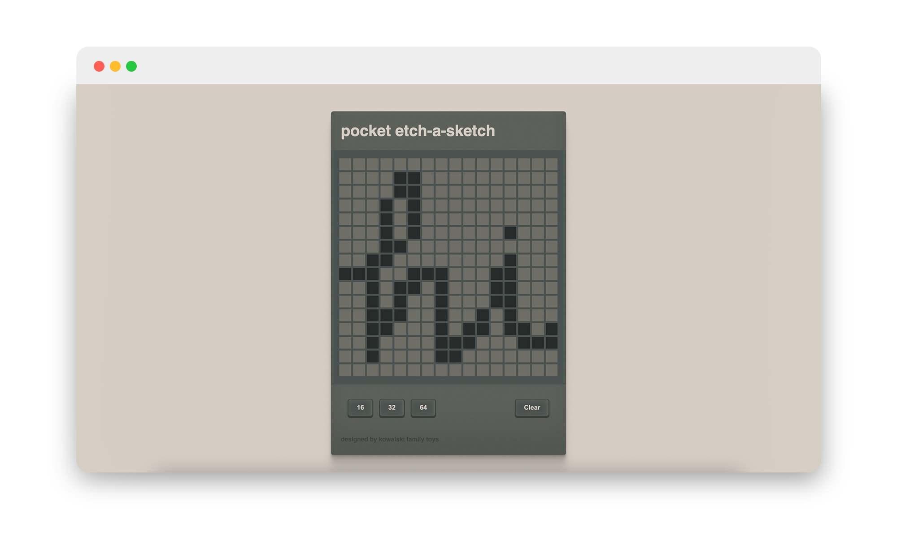
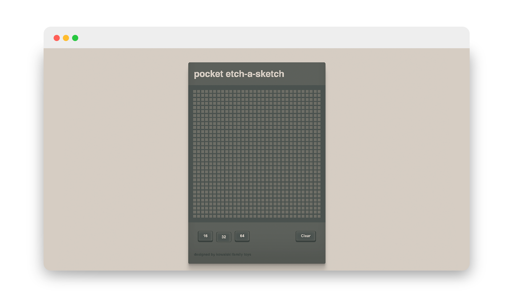

# The Odin Project: Etch-a-sketch Program

This project demonstrates several fundamental JavaScript concepts essential for interactive web development. It utilizes DOM manipulation extensively with document.getElementById, document.createElement, and appendChild to dynamically create and manage elements within the HTML document. Event handling is central, employing addEventListener to respond to user interactions such as clicks (click event) on size control buttons (op1Button, op2Button, op3Button) and clearing the grid (clearButton). Conditional logic (if-else statements) ensures that the grid size (size) updates correctly based on user input, preventing redundant operations. The script leverages CSS manipulation via .style properties to dynamically adjust the size and appearance of grid squares (gridSquare elements). Array iteration (forEach) is used effectively to remove existing grid squares before generating a new grid, maintaining efficiency and responsiveness. Overall, these concepts combine to create a flexible and interactive grid-based interface where users can change grid size and interact with individual grid squares through mouse events.

  

 

The CSS styles define a color palette using CSS variables (--color1 to --color5). The body background is set to var(--color5), creating a light background. The #deviceBody section uses var(--color2) for its background with specific box-shadow effects for a dimensional appearance. Headings (h1) and buttons (button) are styled with defined fonts and colors, including hover and active states for buttons. The grid (#grid) and individual squares (squares) within it are styled with specific dimensions and borders. Overall, the CSS provides a cohesive visual design with careful attention to color scheme, layout, and interactive elements like buttons and grid squares, contributing to a unified user interface.

The button formatting in the CSS uses a clean, transparent background with distinctive top (button-top) and bottom (button-bottom) parts styled for depth and interaction. Each button includes transitions for smooth animation, :active states for feedback, and specific color schemes (var(--color1) and rgb(58, 65, 62)) to maintain visual cohesion with the overall interface design.

  

  I spent a lot of time on the CSS portion making these buttons look 3-dimeional. I am quite happy with how they came out. :)

 

<h3>CSS, JavaScript Concepts Applied</h3>

- if/else statements
- for loop
- .classList.add()
- .style
- .appendChild
- .addEventListner
- .querySelectorAll  
- flex box
- position: absolute / relative
- z-index
- transition on active states (buttons)

 

Super happy with how this project came out, I am excited to start the next!